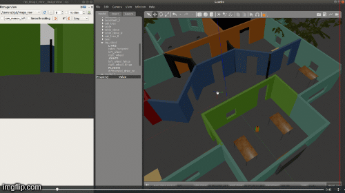

# Project 2: Go Chase It

Use ROS and Gazebo to build a mobile robot for chasing a white ball.

<a href="https://www.youtube.com/watch?v=fugrDDqZiU8&feature=youtu.be" target="_blank">
</a>

## Structure
```
.Project2                          # Go Chase It Project
├── my_robot                       # my_robot package
│   ├── launch                     # launch folder for launch files
│   │   ├── robot_description.launch
│   │   ├── world.launch
│   ├── meshes                     # meshes folder for sensors
│   │   ├── hokuyo.dae
│   ├── urdf                       # urdf folder for xarco files
│   │   ├── my_robot.gazebo
│   │   ├── my_robot.xacro
│   ├── world                      # world folder for world files
│   │   ├── UdacityOffice.world
│   ├── CMakeLists.txt             # compiler instructions
│   ├── package.xml                # package info
├── ball_chaser                    # ball_chaser package
│   ├── launch                     # launch folder for launch files
│   │   ├── ball_chaser.launch
│   ├── src                        # source folder for C++ scripts
│   │   ├── drive_bot.cpp
│   │   ├── process_images.cpp
│   ├── srv                        # service folder for ROS services
│   │   ├── DriveToTarget.srv
│   ├── CMakeLists.txt             # compiler instructions
│   ├── package.xml                # package info
└──
```
**my_robot**: This package defines the world and the robot.

**ball_chaser**: This package contains two ROS nodes for commanding the robot to chase the white ball.

## Setup, Build and Launch
1. Install Gazebo and ROS on Linux.

2. Initialize a catkin workspace
```console
$ mkdir -p catkin_ws/src
$ cd catkin_ws/src
$ catkin_init_workspace
```

3. Within `catkin_ws/src`, clone the project and extract the two packages
```
$ git clone https://github.com/huuanhhuynguyen/RoboND-Go-Chase-It.git
$ cp -R RoboND-Go-Chase-It/ball_chaser .
$ cp -R RoboND-Go-Chase-It/my_robot .
$ rm -rf RoboND-Go-Chase-It
```

4. Move back to `catkin_ws\` and build
```
$ cd ..
$ catkin_make
```

5. Launch the world
```
$ source devel/setup.bash
$ roslaunch my_robot world.launch
```

6. Open another terminal (Ctrl+Shift+T), and launch the `ball_chaser` package
```
$ source devel/setup.bash
$ roslaunch ball_chaser ball_chaser.launch
```

7. Play around! Pick up the white ball and place in front of the mobile robot. The robot will follow the ball.

